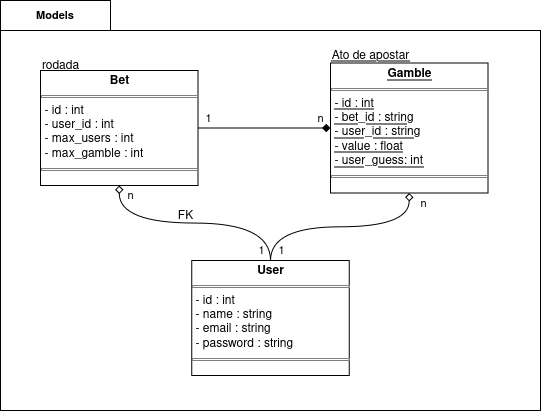

  # Dice-Game (bet de dados)
Trabalho de jogo de dados (apostas) para a matéria Programação Orientada a Objetos da (POO) da Escola Agrícola de Jundiaí (EAJ)
## Requisitos do sistema
## _Funcionais:_
- Cada jogador escolhe o valor de sua aposta;
- Ao início da mesa, cada jogador lança um dado;
- O sistema deve apresentar os dados;
- O sistema deve apresentar um vencedor, caso exista.
## _Não funcionais:_
- O sistema deve ser feito em Java com Springboot;
- O banco de dados deve ser feito usando JDBC;
- O sistema deve ser simplista.
## _Regras de negócios:_
- Cada casa pode ter, no máximo, 25 jogadores;
- O valor do chute do jogador deve ser um valor entre 2 e 12;
- Pode haver mais de um vencedor por partida.
## Diagrama de Classes

## Diagrama de Casos de Uso
